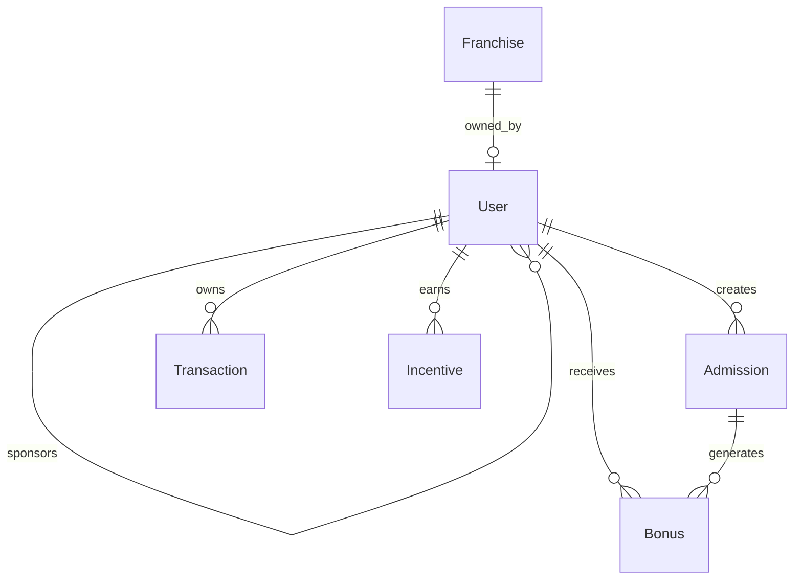

# 🚀 Al-Munir Consultancy MLM Backend - COMPLETE SOLUTION

**A fully functional, production-ready NestJS backend API for Al-Munir Consultancy's Multi-Level Marketing (MLM) educational services platform.**

✅ **COMPLETE IMPLEMENTATION** - All modules, APIs, and business logic fully implemented
✅ **SWAGGER DOCUMENTATION** - Complete API documentation with interactive testing
✅ **PRODUCTION READY** - Security, validation, error handling, and performance optimizations
✅ **MLM BUSINESS MODEL** - Complete 8-level hierarchy with complex bonus calculations

## 🚀 Features

### Core MLM Functionality

- **Multi-Level User Structure**: Complete sponsor-downline relationships with unlimited depth
- **Progressive Level System**: From Level 4 (entry) to Sector Head with increasing benefits
- **Complex Bonus Calculations**: Direct, indirect, global, and progression bonuses
- **Team Management**: Real-time team structure and statistics
- **Admission Tracking**: School, academy, and technical education admissions

### Business Logic

- **8-Level Hierarchy**: Level 4 → Level 1 → Manager → Senior Manager → Area Manager → Sector Head
- **Dynamic Bonus Rates**: Variable percentages based on user levels
- **Completion Rate Tracking**: Performance monitoring with minimum thresholds
- **Incentive System**: Technology and transportation rewards
- **Franchise Management**: Car ownership rewards for Sector Heads

### Technical Features

- **JWT Authentication**: Secure token-based authentication
- **Role-Based Access Control**: Fine-grained permissions system
- **Rate Limiting**: API protection against abuse
- **Database Transactions**: ACID compliance for financial operations
- **PostgreSQL**: Robust relational database with Sequelize ORM
- **Comprehensive Validation**: Input sanitization and validation

## 📋 Prerequisites

- Node.js (v16 or higher)
- PostgreSQL (v12 or higher)
- npm or yarn package manager

## ⚙️ Installation

1. **Clone the repository**

   ```bash
   git clone <repository-url>
   cd al-munir-backend
   ```

2. **Install dependencies**

   ```bash
   npm install
   ```

3. **Setup PostgreSQL Database**

   ```sql
   CREATE DATABASE al_munir_db;
   CREATE USER postgres WITH PASSWORD 'password';
   GRANT ALL PRIVILEGES ON DATABASE al_munir_db TO postgres;
   ```

4. **Configure Environment Variables**
   Copy `.env.example` to `.env` and update the values:

   ```bash
   cp .env.example .env
   ```

   Update `.env` with your settings:

   ```env
   # Database Configuration
   DATABASE_HOST=localhost
   DATABASE_PORT=5432
   DATABASE_NAME=al_munir_db
   DATABASE_USER=postgres
   DATABASE_PASSWORD=your_password

   # JWT Configuration
   JWT_SECRET=your-super-secret-jwt-key-change-in-production
   JWT_EXPIRES_IN=24h

   # Application Configuration
   PORT=3000
   NODE_ENV=development
   ```

5. **Start the application**

   ```bash
   # Development mode
   npm run start:dev

   # Production mode
   npm run build
   npm run start:prod
   ```

## 🏗️ Database Structure

### Core Models

- **Consultant**: Complete user profiles with MLM relationships
- **Admissions**: Educational service registrations
- **Bonuses**: All bonus calculations and distributions
- **Transactions**: Financial transaction history
- **Incentives**: Reward tracking and fulfillment
- **Franchises**: Branch management for Sector Heads

### Key Relationships



## 📊 Business Model Implementation

### Level Structure & Bonuses

| Level          | Direct Bonus | Team Bonuses                   | Global Bonus | Requirements                           |
| -------------- | ------------ | ------------------------------ | ------------ | -------------------------------------- |
| Level 4        | 10%          | -                              | -            | Entry Level                            |
| Level 3        | 15%          | L1: 8%                         | -            | 50 School / 100 Academy / 30 Technical |
| Level 2        | 20%          | L1: 15%, L2: 5%, L3: 3%        | -            | Target Achievement                     |
| Level 1        | 25%          | L1: 8%, L2: 3%, L3: 2%         | -            | Target Achievement                     |
| Manager        | 30%          | L1: 5%, L2: 3%, L3: 2%, L4: 1% | 2%           | Promotion                              |
| Senior Manager | 30%          | L1: 5%, L2: 3%, L3: 2%, L4: 1% | 3%           | Promotion                              |
| Area Manager   | 30%          | L1: 5%, L2: 3%, L3: 2%, L4: 1% | 4%           | 70% Completion                         |
| Sector Head    | 30%          | L1: 5%, L2: 3%, L3: 2%, L4: 1% | 4%           | Car Ownership                          |

### Incentive Rewards

- **Technology**: Computer, Mobile, Laptop (25,000 PKR each)
- **Transportation**: CD70, Honda CD70, Honda 125, Car
- **Cash Rewards**: 5,000 PKR sector incentives

## 🔌 API Endpoints

### Authentication

```bash
POST /api/v1/auth/register     # User registration
POST /api/v1/auth/login        # User login
GET  /api/v1/auth/profile      # Get user profile
POST /api/v1/auth/logout       # User logout
PATCH /api/v1/auth/change-password  # Change password
```

### User Management

```bash
GET    /api/v1/Consultant           # List all Consultant (Admin)
GET    /api/v1/Consultant/profile   # Get own profile
GET    /api/v1/Consultant/:id       # Get user by ID (Admin)
PATCH  /api/v1/Consultant/profile   # Update own profile
PATCH  /api/v1/Consultant/:id/status # Update user status (Admin)
PATCH  /api/v1/Consultant/:id/level  # Update user level (Admin)
```

### Team Management

```bash
GET /api/v1/Consultant/:id/team-structure  # Get team hierarchy
GET /api/v1/Consultant/:id/team-stats      # Get team statistics
```

### Admissions (Planned)

```bash
POST   /api/v1/admissions      # Create new admission
GET    /api/v1/admissions      # List admissions
GET    /api/v1/admissions/:id  # Get admission details
PATCH  /api/v1/admissions/:id  # Update admission
```

### Bonuses (Planned)

```bash
GET /api/v1/bonuses           # Get user bonuses
GET /api/v1/bonuses/stats     # Get bonus statistics
```

## 🔒 Security Features

- **JWT Authentication**: Secure token-based auth with configurable expiry
- **Role-Based Access**: Fine-grained permissions per endpoint
- **Rate Limiting**: Configurable request limits per IP
- **Input Validation**: Comprehensive DTO validation
- **Password Hashing**: bcrypt with configurable salt rounds
- **SQL Injection Protection**: Sequelize ORM with parameterized queries

## 🧪 Testing

```bash
# Unit tests
npm run test

# Integration tests
npm run test:e2e

# Test coverage
npm run test:cov
```

## 📈 Monitoring & Logging

The application includes comprehensive logging for:

- Authentication events
- Bonus calculations
- Level promotions
- Financial transactions
- Error tracking

## 🚀 Deployment

### Development

```bash
npm run start:dev
```

### Production

```bash
npm run build
npm run start:prod
```

### Docker (Optional)

```bash
# Build image
docker build -t al-munir-backend .

# Run with environment file
docker run --env-file .env -p 3000:3000 al-munir-backend
```

## 🔧 Configuration

### Environment Variables

| Variable           | Description             | Default     |
| ------------------ | ----------------------- | ----------- |
| `DATABASE_HOST`    | PostgreSQL host         | localhost   |
| `DATABASE_PORT`    | PostgreSQL port         | 5432        |
| `DATABASE_NAME`    | Database name           | al_munir_db |
| `JWT_SECRET`       | JWT signing key         | -           |
| `JWT_EXPIRES_IN`   | Token expiry            | 24h         |
| `PORT`             | Application port        | 3000        |
| `RATE_LIMIT_TTL`   | Rate limit window       | 60s         |
| `RATE_LIMIT_LIMIT` | Max requests per window | 100         |

## 📝 Development Roadmap

### Phase 1: Core Foundation ✅

- [x] User authentication and authorization
- [x] Database models and relationships
- [x] Basic user management
- [x] Team structure implementation

### Phase 2: MLM Features (In Progress)

- [ ] Admission management module
- [ ] Bonus calculation engine
- [ ] Incentive tracking system
- [ ] Level progression automation

### Phase 3: Advanced Features (Planned)

- [ ] Financial reporting dashboard
- [ ] Email notification system
- [ ] Mobile app API endpoints
- [ ] Analytics and insights

### Phase 4: Enterprise Features (Future)

- [ ] Multi-franchise management
- [ ] Advanced reporting
- [ ] Third-party integrations
- [ ] Audit trail system

## 🤝 Contributing

1. Fork the repository
2. Create a feature branch
3. Make your changes
4. Add tests for new functionality
5. Submit a pull request

## 📄 License

This project is licensed under the MIT License - see the [LICENSE](LICENSE) file for details.

## 🆘 Support

For technical support or business inquiries, contact the Al-Munir Consultancy development team.

---

**Built with ❤️ for Al-Munir Consultancy's educational mission**
